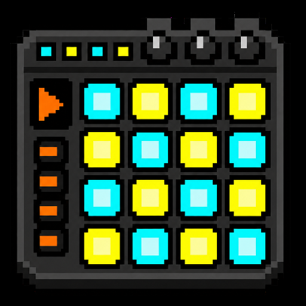

# Pebble Studio




A six-voice, 16-step music-sequencer app for speaker-equipped Pebble watches: a four-voice drum page, Bass/Lead synth page with envelopes, and global effects with flexible routing.

[View Pebble Studio on the Pebble Store](https://apps.repebble.com/bec95167d5404fd1934d80fa)

## Publishing description

Turn your Pebble into a pocket-sized groovebox. Pebble Studio is a playful 16-step sequencer app that lets you build drum, bass, and lead loops directly on your wrist, then hear them through the watch's built-in speaker. Shape the loop with Volume, Drive, and Space effects on the watch or from the phone editor.

Create rhythms with four synthesized drum voices and two melodic voices, move through the grid with the hardware buttons, adjust tempo from 60 to 240 BPM, and keep patterns and effects saved between sessions. The Pebble mobile app includes a full editor and effect sliders for composing from your phone. Designed for quick musical sketches, tiny loops, and joyful wrist-bound bleeps.

**Requires a speaker-equipped Pebble:** Pebble 2 Duo or Pebble Time 2. Pebble SDK 4.9 or later is required.

## Supported hardware

Pebble Studio intentionally targets only the watches with a hardware speaker:

- Pebble 2 Duo (`flint`)
- Pebble Time 2 (`emery`)

It excludes legacy Pebble 2 (microphone only) and Pebble Round 2 (no speaker).
It requires Pebble SDK 4.9 or newer because that is when the Speaker API arrived.

## Screenshots

| Pebble 2 Duo (Flint) | Pebble Time 2 (Emery) |
| --- | --- |
|  |  |

## Controls

| Control | Action |
| --- | --- |
| Up / Down | Previous / next step |
| Hold Up / Hold Down | Previous / next row |
| Double Up / Double Down | Raise / lower tempo by 5 BPM (or change synth pitch on the Synth page) |
| Select | Toggle the selected step |
| Double Select | Switch between Drum, Synth, Synth Shape, Effects, and FX Routing pages |
| Effects page: Up / Down | Raise / lower the selected effect by 5 (double for 10) |
| Effects page: Hold Up / Hold Down | Select Volume, Drive, or Space |
| Synth Shape page: Up / Down | Adjust Bass/Lead Attack or Decay (double for 10) |
| Synth Shape page: Hold Up / Hold Down | Select a shape control |
| FX Routing page: Up / Down | Select Drums, Bass, or Lead target |
| FX Routing page: Hold Up / Hold Down | Select Drive or Space |
| FX Routing page: Select | Toggle the selected target |
| Hold Select | Start / stop playback |
| Back | Exit the app |

The Drum page uses one-shot 8 kHz PCM samples generated on the watch: red is a pitch-dropping Kick, orange is a noise-and-body Snare, green is a filtered-noise Hi-hat, and blue is a click-and-tone Rim shot. The Synth page uses an audible C4–C5 low-synth layer and C5–C6 Lead, deliberately shifted above the Pebble speaker's weak low end. Double Up/Down changes the selected synth step through a compact C-major scale; the current note appears in the header. Before playback, Pebble Studio renders the complete bar into a PCM cache, so all four drum voices and both synth voices play together without putting effects work in the speaker stream. Each lit cell plays a hit or note; unlit cells are rests. Patterns, tempo, envelopes, and effects persist on the watch. A small green dot (white on Pebble 2) indicates playback; the white outline is the edit cursor.

Every 16-step row is one 4/4 bar. A divider after steps 4, 8, and 12 marks the four beats on both the watch and phone editor.

## Edit from the Pebble mobile app

The companion app opens an editor from the app's **Settings** screen in the Pebble mobile app using its saved phone copy, so it remains responsive even when the configuration bridge cannot complete a watch-to-phone state request. Tracks are collapsible to keep the editor compact; tap a synth pitch to raise it one scale note, or press and hold to lower it. The editor can change every value and writes them back one field at a time; each delivered field is paced and retried up to twice. Keep Pebble Studio open while saving.

The Effects page and matching phone sliders provide **Volume** (default 90/100), **Drive** (soft-clipped gain), and **Space** (a short feedback echo). The Synth Shape page adds independent **Attack** and **Decay** envelopes for Bass and Lead. FX Routing lets Drive and Space affect Drums, Bass, and Lead independently; Volume remains a master level. All controls persist on the watch. Volume updates immediately; pattern, envelope, Drive, Space, and routing changes apply the next time playback starts. Space is intentionally a compact echo rather than a CPU-heavy reverb, preserving stable playback on Pebble hardware.

The configuration webview is deployed automatically by the GitHub Pages workflow from `config/` whenever that directory changes. The release build points to `https://ndiesslin.github.io/pebble-studio/`. If the repository is transferred or renamed, update `CONFIG_URL` in `src/pkjs/index.js`, rebuild the `.pbw`, and verify the Settings round trip in the Pebble mobile app. No server or account credentials are needed by the editor.

## Build and install

Install the current Pebble CLI and SDK, then run:

```sh
pebble sdk install latest
pebble build
pebble install --emulator emery
```

Use a physical Pebble 2 Duo or Pebble Time 2 for audio. The emulator is useful for checking layout and controls, but cannot reproduce the watch speaker.

## Pebble Store release checklist

- Create the listing as a **watchapp** (not a watchface) in **Tools & Utilities**.
- Upload a release compatible with `flint` and `emery`, plus screenshots for both devices.
- Upload the small and large app icons, and a 720×320 banner for each supported platform.
- Keep both the listing's **Published** visibility setting and the release's publication setting off until launch; they are separate controls.
- Set the source URL to [github.com/ndiesslin/pebble-studio](https://github.com/ndiesslin/pebble-studio).

## Design notes

The app renders all four drum voices and both synth voices into one 16-step, 8 kHz PCM cache before playback begins. The small speaker pump then only copies cached audio, while the beat-rate playback indicator avoids competing with it. Sound-affecting edits mark the cache for the next start instead of interrupting the current loop. A failed or preempted stream changes the header to `AUDIO ERROR` and stops transport. System speaker mute / Quiet Time applies normally; firmware controls it and this SDK revision does not expose its mute state to the app.

## Sources

- [Pebble hardware capability matrix](https://developer.repebble.com/guides/tools-and-resources/hardware-information/)
- [Pebble Speaker API](https://developer.repebble.com/docs/c/User_Interface/Speaker/)
- [Pebble SDK installation guide](https://developer.repebble.com/sdk/)

## License

[MIT](LICENSE)
