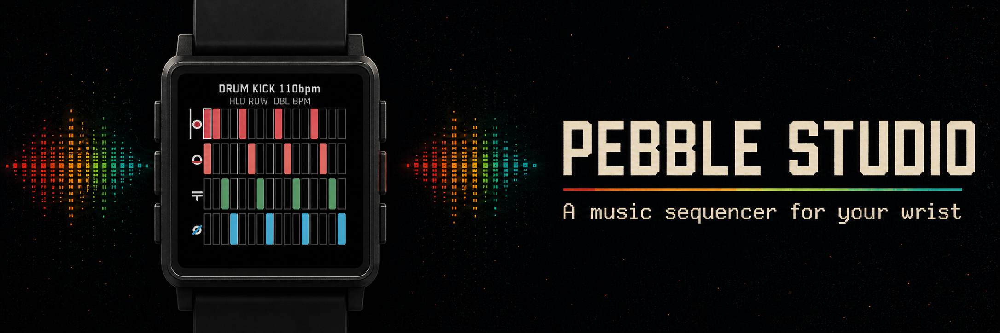
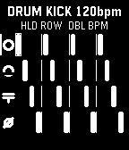
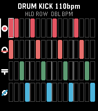

# Pebble Steps



A six-voice, 16-step music-sequencer app for speaker-equipped Pebble watches: a four-voice drum page plus a Bass/Lead synth page.

## Publishing description

Turn your Pebble into a pocket-sized groovebox. Pebble Steps is a playful 16-step sequencer app that lets you build drum, bass, and lead loops directly on your wrist, then hear them through the watch's built-in speaker.

Create rhythms with four synthesized drum voices and two melodic voices, move through the grid with the hardware buttons, adjust tempo from 60 to 240 BPM, and keep patterns saved between sessions. The Pebble mobile app includes a full editor for composing from your phone. Designed for quick musical sketches, tiny loops, and joyful wrist-bound bleeps.

**Requires a speaker-equipped Pebble:** Pebble 2 Duo or Pebble Time 2. Pebble SDK 4.9 or later is required.

## Supported hardware

Pebble Steps intentionally targets only the watches with a hardware speaker:

- Pebble 2 Duo (`flint`)
- Pebble Time 2 (`emery`)

It excludes legacy Pebble 2 (microphone only) and Pebble Round 2 (no speaker).
It requires Pebble SDK 4.9 or newer because that is when the Speaker API arrived.

## Screenshots

| Pebble 2 Duo (Flint) | Pebble Time 2 (Emery) |
| --- | --- |
|  |  |

## Controls

| Control | Action |
| --- | --- |
| Up / Down | Previous / next step |
| Hold Up / Hold Down | Previous / next row |
| Double Up / Double Down | Raise / lower tempo by 5 BPM (or change synth pitch on the Synth page) |
| Select | Toggle the selected step |
| Double Select | Switch between Drum and Synth pages |
| Hold Select | Start / stop playback |
| Back | Exit the app |

The Drum page uses one-shot 8 kHz PCM samples generated on the watch: red is a pitch-dropping Kick, orange is a noise-and-body Snare, green is a filtered-noise Hi-hat, and blue is a click-and-tone Rim shot. The Synth page adds a warm Bass and bright Lead. Double Up/Down changes the selected synth step through a compact C-major scale; the current note appears in the header. Playback uses a streamed PCM mixer, so all four drum voices and both synth voices play together. Each lit cell plays a hit or note; unlit cells are rests. Patterns and tempo persist on the watch. A yellow outline follows playback; the white outline is the edit cursor.

Every 16-step row is one 4/4 bar. A divider after steps 4, 8, and 12 marks the four beats on both the watch and phone editor.

## Edit from the Pebble mobile app

The companion app opens an editor from the app's **Settings** screen in the Pebble mobile app. It synchronizes all 96 drum and synth steps, all 32 synth pitches, tempo, and the current play/stop state before opening. The editor can change every one of those values and writes them back to the watch in one save.

The configuration webview is deployed automatically by the GitHub Pages workflow from `config/` whenever that directory changes. The release build points to `https://ndiesslin.github.io/pebble-step-sequencer/`. If the repository is transferred or renamed, update `CONFIG_URL` in `src/pkjs/index.js`, rebuild the `.pbw`, and verify the Settings round trip in the Pebble mobile app. No server or account credentials are needed by the editor.

## Build and install

Install the current Pebble CLI and SDK, then run:

```sh
pebble sdk install latest
pebble build
pebble install --emulator emery
```

Use a physical Pebble 2 Duo or Pebble Time 2 for audio. The emulator is useful for checking layout and controls, but cannot reproduce the watch speaker.

## Design notes

The app builds one 16-step `SpeakerTrack` per voice and sends the active page together with `speaker_play_tracks()`, producing aligned polyphonic playback. When the pattern finishes, the speaker completion callback queues the next loop. A failed or preempted start changes the header to `ERR` and stops transport. System speaker mute / Quiet Time applies normally; firmware controls it and this SDK revision does not expose its mute state to the app.

## Sources

- [Pebble hardware capability matrix](https://developer.repebble.com/guides/tools-and-resources/hardware-information/)
- [Pebble Speaker API](https://developer.repebble.com/docs/c/User_Interface/Speaker/)
- [Pebble SDK installation guide](https://developer.repebble.com/sdk/)

## License

[MIT](LICENSE)
